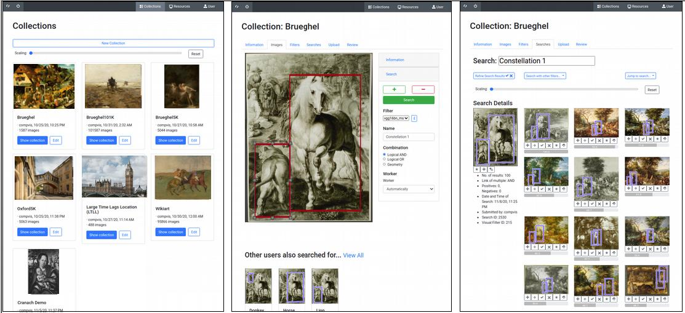

# Visual-Search-Code

This repository contains the code for the submitted mauscript:
>Ufer, N., Simon, M., Lang, and Ommer, B. (2021): Large-scale interactive retrieval in art collections usingmulti-style feature aggregation 

## Repository description
- General structure:
    - `api`: php code for the rest-api client 
    - `apache2`: config file examples for apache2 
    - `mysql`: template for the mysql database
    - `frontend`: angular code for the frontend 
    - `search_backend`: python code for the initialization and retrieval workers including the rertieval algorithm

## Installation
All code tested on Ubuntu 18.04

### Software
Install general dependencies (use requirements.txt):
- Python 3.6
- Python packages:
    - pytorch 1.2
    - torchvision 0.4 
    - faiss-gpu 1.6
    - scipy, scikit-image, scikit-learn, opencv-python
    - cython, easydict, h5py, hdfdict, pillow, pandas, requests
- PHP 7.2
- MySQL 5.7 
- phpMyAdmin 4.9  (optional)
- Node.js 8.9
- Angular CLI 6.1
- Apache 2.4

### Instructions
Follow the readme in `api` to install/configure the rest api
- install php 
- configure api with mysql database password, api secret and root path   
- copy api to desired location

Follow the readme in `apache2` to install/configure the apache server
- install and configure apache
- start apache server   

Follow readme in `mysql` to install/configure the database
- install mysql-server and phpmyadmin
- import database template (includes interface user: *test* with password: *test*)
- set mysql database password

Follow the readme in `frontend` to install/configure the frontend
- install node.js and angular
- build the single page application
- copy to desired location

Follow the reamde in `search_backend`
- install python and packages using requirements.txt
- adjust start_init_worker_template.sh and start_search_worker_template.sh
- start initialization workers 
- start search workers

### Hardware
The frontend and REST API can run on a server without GPU support and 
the visual search backend can run on another machine with a single GPU (we used NVIDIA Quadro P5000).

### References
This repository also includes external code. In particular, we want to mention:
> - Jiangs's et al. *PreciseRoIPooling* repository: https://github.com/vacancy/PreciseRoIPooling
> - Li's et al. *LinearStyleTransfer* repository, which we slightly adapted: https://github.com/sunshineatnoon/LinearStyleTransfer 

